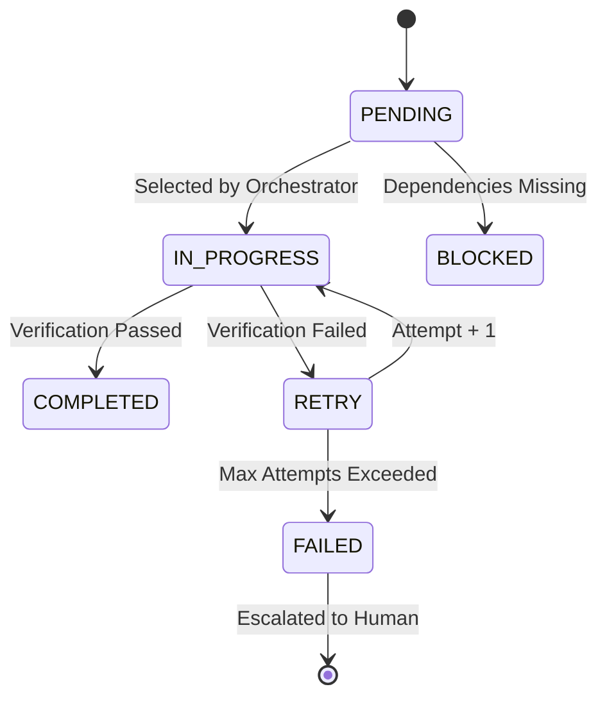

# Task Lifecycle

In Conductor, a "Task" is not just a to-do item. It is a managed entity with a rigid lifecycle, complexity score, and state machine.

This document details exactly how a task moves from `PENDING` to `COMPLETED`.

---

## 🔄 The State Machine

Every task follows this strict path:

| Status | Meaning |
|--------|---------|
| **PENDING** | Valid, but waiting for a worker slot or dependency. |
| **BLOCKED** | Cannot run because a parent task (e.g., T1) is not done. |
| **IN_PROGRESS** | Currently loaded into a Worker (Claude) context. |
| **RETRY** | Failed verification (e.g., tests failed). Retrying with new prompt. |
| **FAILED** | Failed 3x. Human intervention required. |
| **COMPLETED** | Verified by 4-Eyes Protocol and committed. |

---

## 📐 Complexity Scoring (The "Triangle" Principle)

We do not just count lines of code. We measure **Cognitive Load**.
A task is rejected if it exceeds a **Critical Complexity Score (11+)**.

The score is calculated as:
$$ Score = FileScope + Dependencies + SemanticComplexity + Uncertainty $$

| Component | Points | Description |
|-----------|--------|-------------|
| **File Scope** | 0.5 per file | Modifying 10 files = 5 points (Max). |
| **Dependencies**| 0-2 points | Does this touch DB *and* UI *and* API? |
| **Semantic** | 0-3 points | "CRUD" is low. "Paxos Algorithm" is high. |
| **Uncertainty** | 0-2 points | "Make it pretty" = +2 points. |

### Auto-Splitting Strategies
If a task is too big (Score > 5), the Planner splits it automatically:

1.  **File Strategy**: Group by directory (e.g., "Frontend Task", "Backend Task").
2.  **Layer Strategy**: Group by Architecture (e.g., "Data Layer", "Service Layer").
3.  **Criteria Strategy**: Group by requirements (e.g., "Login Logic", "Logout Logic").

---

## ⛓️ Dependency Resolution

Tasks form a **Directed Acyclic Graph (DAG)**.

*   **Explicit Deps**: Task T2 says "I need T1".
*   **Implicit Deps**: Task T2 modifies `auth.py`, which T1 creates. The system detects this and forces T1 -> T2.
*   **Deadlock Detection**: If T1 needs T2 and T2 needs T1, the Planner halts and asks for help.

---

## 🏃 The Execution Loop

When a task enters `IN_PROGRESS`, it enters the **Ralph Wiggum Loop** (Iterative TDD):

1.  **Context Loading**: The agent loads *only* the files related to this task.
2.  **Test Generation (Red)**: Agent writes a failing test.
3.  **Implementation (Green)**: Agent writes the code.
4.  **Verification**: System runs `pytest`.
    *   *Pass*: Move to 4-Eyes Review.
    *   *Fail*: Feed error to **Bug Fixer Agent**.
5.  **Refactor**: (Optional) Cleanup phase.

---

## ⚡ Parallel Execution (Git Worktrees)

Conductor runs independent tasks in parallel using **Git Worktrees**.

*   **Isolation**: Worker A sees `folder_A/`. Worker B sees `folder_B/`.
*   **Safety**: They cannot touch the same file.
*   **Merge**: The Orchestrator cherry-picks successful commits back to `main`.

If two tasks try to touch `utils.py`, they are forced to run **Sequentially**.
