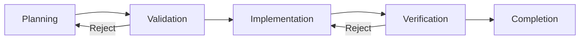

# The 5-Phase Workflow

Conductor enforces a strict **Software Development Life Cycle (SDLC)**. Every feature goes through 5 phases. You cannot skip a phase.

---

##  Phase 1: Planning 🗺️
**Agent**: A01 (Planner)

The system reads your `PRODUCT.md`. It does NOT start coding.
Instead, it produces a **Plan (`plan.json`)**.

*   **What happens**:
    1.  Analyzes requirements.
    2.  Check for ambiguities (e.g., "What database do we use?").
    3.  Breaks work into **Atomic Tasks**.
*   **Output**: A list of steps. "Create table", "Add endpoint", "Frontend button".

---

## Phase 2: Validation 🛡️
**Agents**: A07 (Security) + A02 (Architect) (Running in **Parallel**)

Before we write a single line of code, we critique the plan.

*   **Security Check**: "Does this plan introduce an SQL injection risk?"
*   **Arch Check**: "Does this plan violate our 'One Service Per File' rule?"
*   **The Gate**: Both agents must give a score > 6/10. Reviewers can **Veto** the plan, sending it back to Phase 1.

---

## Phase 3: Implementation (TDD) 💻
**Agents**: A03 (Test Writer) -> A04 (Implementer) -> A05 (Bug Fixer)

This is the "Loop".

1.  **Red (A03)**: A Test Writer creates a test file `tests/test_feature.py`. It runs and **FAILS** (because the feature doesn't exist yet).
2.  **Green (A04)**: The Implementer writes `src/feature.py`. It runs the test.
    *   *If Pass*: Move on.
    *   *If Fail*: **Self-Healing kicks in**. The A05 (Bug Fixer) reads the error and tries to fix the code. It gets 3 attempts.

---

## Phase 4: Verification 🔍
**Agents**: A07 (Security) + A08 (Code Reviewer)

The code works. But is it good?

*   **Security Scan**: Checks the actual code for hardcoded secrets or unsafe patterns.
*   **Quality Scan**: Checks for messy code, lack of comments, or confusing variable names.
*   **The Gate**: Strict approval required (Score > 7/10).

---

## Phase 5: Completion ✅
**Agent**: Orchestrator

1.  Generate a **Summary Report**.
2.  Update the `COMPLETED` status.
3.  Commit the code to Git.

---

## 🚨 Emergency Systems

### The "Fixer"
If an agent gets stuck (e.g., a syntax error that won't go away), the system pauses and engages the **Fixer Subgraph**. This is a specialized loop that only cares about making the code compile/run.

### Human Intervention
If the agents are fighting (e.g., Security says "No", Architect says "Yes"), the system halts and asks **YOU** (the human) to break the tie.
